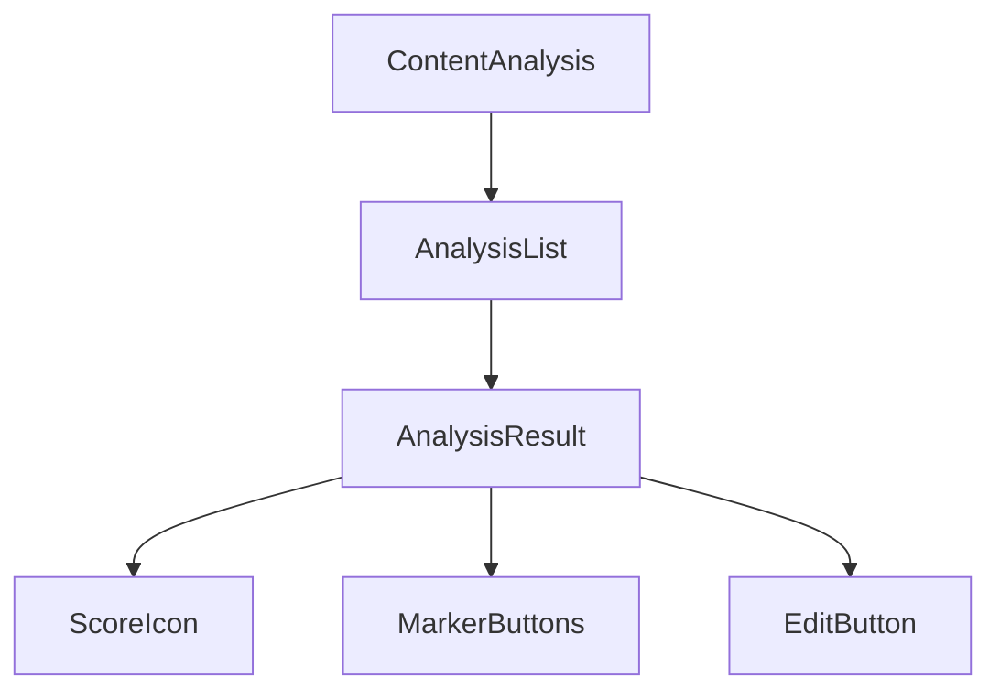
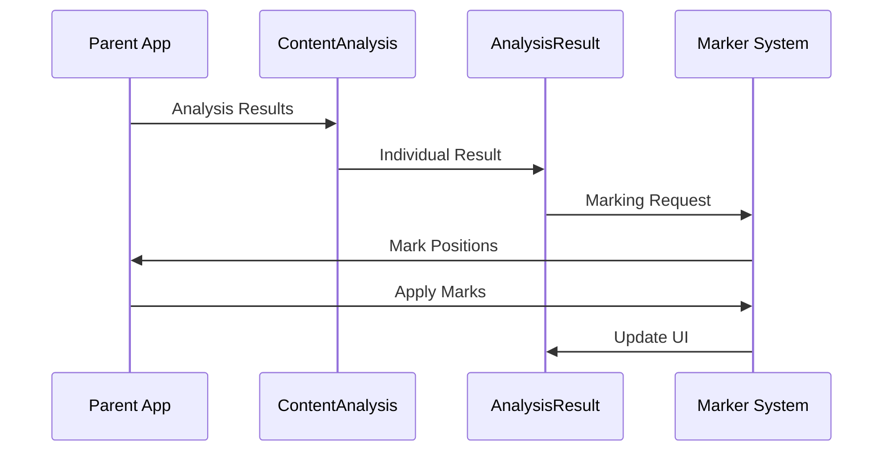

# @yoast/analysis-report

React components for visualizing SEO and readability analysis results from YoastSEO.js.

## Overview

This package provides React components to display the results of content analysis performed by the [@yoast/yoastseo](../yoastseo) package. It visualizes SEO scores, readability metrics, and improvement suggestions in an organized and user-friendly way.

## Installation

```bash
yarn add @yoast/analysis-report
```

Note: This package has peer dependencies that need to be installed:
- react
- react-dom
- styled-components
- @wordpress/i18n

## Package Dependencies
```mermaid
graph TD
    A[@yoast/analysis-report] --> B[@yoast/components]
    A --> C[@yoast/helpers]
    A --> D[@yoast/style-guide]
    A --> E[@wordpress/i18n]
    B --> D
    classDef current font-weight:bold,fill:#A61E69,color:#fff,stroke-width:3px
    classDef yoast fill:#A61E69,color:#fff,stroke-width:1px
    class A current
    class B,C,D yoast
```

## Core Components

### ContentAnalysis
The main component that organizes analysis results into collapsible sections:

#### Props
```typescript
interface ContentAnalysisProps {
  // Results categorized by type
  problemsResults: AnalysisResult[];
  improvementsResults: AnalysisResult[];
  goodResults: AnalysisResult[];
  considerationsResults: AnalysisResult[];
  errorsResults: AnalysisResult[];
  upsellResults?: AnalysisResult[];

  // Handlers
  onMarkButtonClick: (id: string, marker: Marker) => void;
  onEditButtonClick: (id: string, fieldName: string) => void;

  // Configuration
  headingLevel?: number;  // Default: 4
  marksButtonStatus?: "enabled" | "disabled" | "hidden";
  marksButtonClassName?: string;
  editButtonClassName?: string;
  
  // State
  activeMarker?: string;
  
  // Premium features
  isPremium?: boolean;
  shouldUpsellHighlighting?: boolean;
}
```

#### Features
- Automatically collapses/expands sections
- Handles section ordering by priority
- Manages marker button states
- Supports custom category labels

#### Example Usage
```jsx
import { ContentAnalysis } from "@yoast/analysis-report";

function MyAnalysis() {
  const results = {
    problemsResults: [
      {
        text: "Your text is too short",
        id: "textLength",
        rating: "bad",
        hasMarks: false
      }
    ],
    improvementsResults: [...],
    goodResults: [...],
    considerationsResults: [...],
    errorsResults: [...]
  };

  return (
    <ContentAnalysis
      problemsResults={results.problemsResults}
      improvementsResults={results.improvementsResults}
      goodResults={results.goodResults}
      considerationsResults={results.considerationsResults}
      errorsResults={results.errorsResults}
      onMarkButtonClick={(id, marker) => {
        // Handle text marking
      }}
    />
  );
}
```

### AnalysisResult
Individual result item with score indicator and optional marking functionality:

#### Props
```typescript
interface AnalysisResultProps {
  // Content
  text: string;             // HTML string with analysis feedback
  score: number;            // 0-100 score
  rating: "good" | "OK" | "bad" | "feedback" | "upsell";
  id: string;              // Unique identifier
  
  // Marking functionality
  hasMarks: boolean;       // Whether this result supports text marking
  marker?: Marker;         // Marking instructions
  marksButtonStatus?: "enabled" | "disabled" | "hidden";
  
  // Edit functionality
  hasEditButton: boolean;  // Whether to show edit button
  editFieldName?: string;  // Field to focus when edit clicked
  
  // Styling
  bulletColor: string;     // Color for score indicator
  marksButtonClassName?: string;
  editButtonClassName?: string;
  
  // Accessibility
  ariaLabelMarks: string;
  ariaLabelEdit?: string;
  
  // State
  pressed: boolean;        // Whether marks are active
  suppressedText?: boolean;// Grey out the text
}
```

#### Features
- Sanitizes HTML in text content
- Manages button states and interactions
- Handles accessibility attributes
- Supports custom styling

```jsx
import { AnalysisResult } from "@yoast/analysis-report";

function SingleResult() {
  return (
    <AnalysisResult
      text="This is the analysis feedback"
      score={9}
      rating="good" 
      hasMarks={true}
      hasEditButton={true}
      marker={() => {
        // Marking logic
      }}
      onButtonClick={() => {
        // Handle button click
      }}
    />
  );
}
```

### SiteSEOReport  
Displays overall SEO score with a stacked progress bar:

#### Props
```typescript
interface SiteSEOReportProps {
  className?: string;
  seoAssessmentText: string;
  seoAssessmentItems: Array<{
    html: string;          // HTML content for item description
    value: number;         // Percentage value (0-100)
    color: string;         // Color for progress bar segment
  }>;
  barHeight?: string;      // Custom height for progress bar
}
```

#### Features
- Renders stacked progress bars
- Displays score breakdowns
- Supports custom styling and dimensions
- Handles responsive layouts

#### Example Usage
```jsx
import { SiteSEOReport } from "@yoast/analysis-report";

function Overview() {
  const items = [
    {
      value: 60,
      color: "#7ad03a",
      html: "60% of your pages have good SEO scores"
    },
    // ...more items
  ];

  return (
    <SiteSEOReport
      seoAssessmentText="Overall SEO score"
      seoAssessmentItems={items}
    />
  );
}
```

## Component Architecture



## Usage Outside of WordPress

When using this package outside of WordPress, keep in mind:

1. **Translations**: The package uses @wordpress/i18n for translations. You'll need to:
   - Provide your own translation implementation
   - Mock the i18n functions in tests
   - Set up the translation infrastructure

2. **Styling**: The package uses styled-components and expects certain theme variables:
   - Provide theme context
   - Define color variables
   - Set up proper CSS-in-JS tooling

3. **Icons**: Icons are provided by @yoast/components:
   - Ensure proper SVG support
   - Consider icon loading strategy
   - Handle icon accessibility

## Example Integration

```jsx
import { ContentAnalysis, AnalysisResult } from "@yoast/analysis-report";
import { Paper } from "@yoast/yoastseo";
import { analyze } from "./your-analysis-logic";

function SEOAnalysis({ content }) {
  // Create a paper for analysis
  const paper = new Paper(content, {
    keyword: "example",
    locale: "en_US"
  });

  // Get analysis results
  const results = analyze(paper);

  // Transform results for the ContentAnalysis component
  const transformedResults = {
    problemsResults: results.filter(r => r.score < 4),
    goodResults: results.filter(r => r.score >= 7),
    // ... transform other categories
  };

  return (
    <div className="seo-analysis">
      <h2>SEO Analysis</h2>
      <ContentAnalysis
        {...transformedResults}
        onMarkButtonClick={(id, marker) => {
          // Implement marking logic
        }}
        onEditButtonClick={(id) => {
          // Implement edit navigation
        }}
      />
    </div>
  );
}
```

## Marking & Editing Functionality

### Text Marking System

The marking system allows highlighting relevant parts of the text that correspond to specific analysis results. This is implemented through the `marker` prop and `onMarkButtonClick` handler.

#### Marker Implementation

A marker can be either a function or an array of marking instructions:

```javascript
// Function marker
const functionMarker = () => {
  return [
    {
      marked: "This text needs improvement",
      original: "This text needs improvement",
      position: {
        startOffset: 0,
        endOffset: 24
      }
    }
  ];
};

// Array marker
const arrayMarker = [
  {
    _startOffset: 0,
    _endOffset: 24,
    _marked: "This text needs improvement",
    _original: "This text needs improvement"
  }
];
```

#### Marking Flow

1. User clicks the eye icon (mark button)
2. `onMarkButtonClick` is called with:
   - `id`: The unique identifier of the assessment result
   - `marker`: The marking instructions
3. The parent application should then:
   - Apply the marks to the text
   - Update the UI to show the marked text
   - Handle mark toggling (removing marks when clicked again)

### Edit Button System

The edit button system facilitates navigation to the relevant editing field for a specific assessment result.

```javascript
<ContentAnalysis
  {...results}
  onEditButtonClick={(id, fieldName) => {
    // fieldName could be "title", "metaDescription", "text", etc.
    focusField(fieldName);
  }}
/>
```

#### Edit Button Behavior

1. **Visibility**: Edit buttons only appear when:
   - `hasEditButton` is true for the result
   - A valid `editFieldName` is provided
   - The result is not suppressed

2. **Navigation**: When clicked, should:
   - Focus the corresponding input field
   - Scroll to the field if needed
   - Optionally highlight the field

3. **Accessibility**: 
   - Includes proper ARIA labels (e.g., "Edit your meta description")
   - Supports keyboard navigation
   - Provides visual feedback on focus/hover

### Integration Example

```jsx
function SEOAnalysisWithMarking({ content }) {
  const [activeMarker, setActiveMarker] = useState("");
  const [marks, setMarks] = useState([]);

  const handleMarkClick = (id, marker) => {
    if (activeMarker === id) {
      // Remove marks
      setMarks([]);
      setActiveMarker("");
    } else {
      // Apply new marks
      const newMarks = typeof marker === "function" 
        ? marker() 
        : marker;
      setMarks(newMarks);
      setActiveMarker(id);
    }
  };

  const handleEditClick = (id, fieldName) => {
    const field = document.querySelector(`[name="${fieldName}"]`);
    if (field) {
      field.focus();
      field.scrollIntoView({ behavior: "smooth" });
    }
  };

  return (
    <>
      <ContentAnalysis
        {...results}
        marksButtonActivatedResult={activeMarker}
        onMarkButtonClick={handleMarkClick}
        onEditButtonClick={handleEditClick}
      />
      <TextEditor
        content={content}
        marks={marks}
        onMarkingRequired={handleMarkClick}
      />
    </>
  );
}
```

## Components Reference

### ContentAnalysis

The root component that organizes and displays all analysis results in categorized, collapsible sections.

#### Props
```typescript
interface ContentAnalysisProps {
  // Results categorized by type
  problemsResults: AnalysisResult[];
  improvementsResults: AnalysisResult[];
  goodResults: AnalysisResult[];
  considerationsResults: AnalysisResult[];
  errorsResults: AnalysisResult[];
  upsellResults?: AnalysisResult[];

  // Handlers
  onMarkButtonClick: (id: string, marker: Marker) => void;
  onEditButtonClick: (id: string, fieldName: string) => void;

  // Configuration
  headingLevel?: number;  // Default: 4
  marksButtonStatus?: "enabled" | "disabled" | "hidden";
  marksButtonClassName?: string;
  editButtonClassName?: string;
  
  // State
  activeMarker?: string;
  
  // Premium features
  isPremium?: boolean;
  shouldUpsellHighlighting?: boolean;
}
```

#### Features
- Automatically collapses/expands sections
- Handles section ordering by priority
- Manages marker button states
- Supports custom category labels

### AnalysisResult

Individual result item that displays a single analysis outcome with interactive elements.

#### Props
```typescript
interface AnalysisResultProps {
  // Content
  text: string;             // HTML string with analysis feedback
  score: number;            // 0-100 score
  rating: "good" | "OK" | "bad" | "feedback" | "upsell";
  id: string;              // Unique identifier
  
  // Marking functionality
  hasMarks: boolean;       // Whether this result supports text marking
  marker?: Marker;         // Marking instructions
  marksButtonStatus?: "enabled" | "disabled" | "hidden";
  
  // Edit functionality
  hasEditButton: boolean;  // Whether to show edit button
  editFieldName?: string;  // Field to focus when edit clicked
  
  // Styling
  bulletColor: string;     // Color for score indicator
  marksButtonClassName?: string;
  editButtonClassName?: string;
  
  // Accessibility
  ariaLabelMarks: string;
  ariaLabelEdit?: string;
  
  // State
  pressed: boolean;        // Whether marks are active
  suppressedText?: boolean;// Grey out the text
}
```

#### Features
- Sanitizes HTML in text content
- Manages button states and interactions
- Handles accessibility attributes
- Supports custom styling

### SiteSEOReport

Displays aggregate SEO scores with a stacked progress bar visualization.

#### Props
```typescript
interface SiteSEOReportProps {
  className?: string;
  seoAssessmentText: string;
  seoAssessmentItems: Array<{
    html: string;          // HTML content for item description
    value: number;         // Percentage value (0-100)
    color: string;         // Color for progress bar segment
  }>;
  barHeight?: string;      // Custom height for progress bar
}
```

#### Features
- Renders stacked progress bars
- Displays score breakdowns
- Supports custom styling and dimensions
- Handles responsive layouts

## Component Interactions

### Data Flow


### State Management

The components follow a unidirectional data flow:

1. **Parent Level**
   ```javascript
   {
     activeMarker: string | null;    // Currently active marker
     marks: Mark[];                  // Active text marks
     results: AnalysisResult[];      // Analysis results
   }
   ```

2. **ContentAnalysis Level**
   ```javascript
   {
     collapsibleStates: {           // Section collapse states
       [category: string]: boolean
     }
   }
   ```

3. **AnalysisResult Level**
   ```javascript
   {
     isHovered: boolean;            // UI hover state
     isPressed: boolean;            // Marker active state
   }
   ```

## Contributing

See [CONTRIBUTING.md](../../.github/CONTRIBUTING.md) for details on:
- Development setup
- Testing
- Code style
- Pull request process

## License

GPL-3.0, see [LICENSE](./LICENSE) for details.
