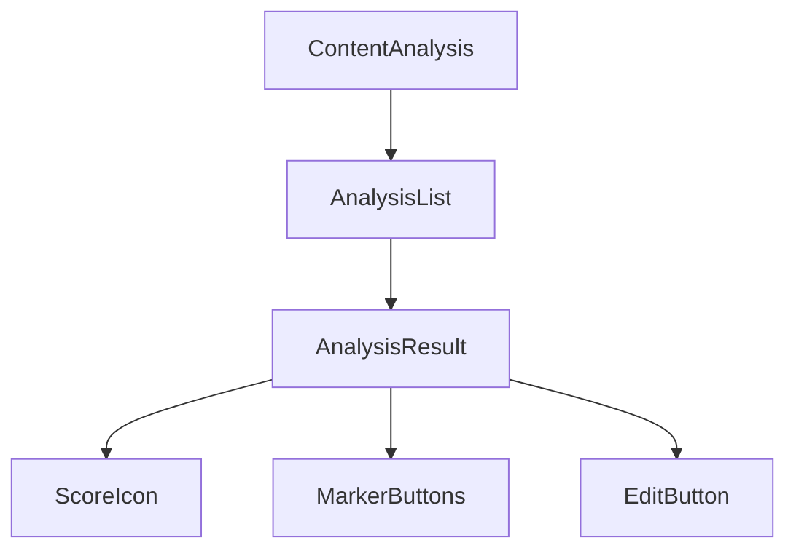

# @yoast/analysis-report

React components for visualizing SEO and readability analysis results from YoastSEO.js.

## Overview

This package provides React components to display the results of content analysis performed by the [@yoast/yoastseo](../yoastseo) package. It visualizes SEO scores, readability metrics, and improvement suggestions in an organized and user-friendly way.

## Installation

```bash
yarn add @yoast/analysis-report
```

Note: This package has peer dependencies that need to be installed:
- react
- react-dom
- styled-components
- @wordpress/i18n

## Package Dependencies
```mermaid
graph TD
    A[@yoast/analysis-report] --> B[@yoast/components]
    A --> C[@yoast/helpers]
    A --> D[@yoast/style-guide]
    A --> E[@wordpress/i18n]
    B --> D
    classDef current font-weight:bold,fill:#A61E69,color:#fff,stroke-width:3px
    classDef yoast fill:#A61E69,color:#fff,stroke-width:1px
    class A current
    class B,C,D yoast
```

## Core Components

### ContentAnalysis
The main component that organizes analysis results into collapsible sections:
- Errors
- Problems
- Improvements
- Good Results
- Considerations

```jsx
import { ContentAnalysis } from "@yoast/analysis-report";

function MyAnalysis() {
  const results = {
    problemsResults: [
      {
        text: "Your text is too short",
        id: "textLength",
        rating: "bad",
        hasMarks: false
      }
    ],
    improvementsResults: [...],
    goodResults: [...],
    considerationsResults: [...],
    errorsResults: [...]
  };

  return (
    <ContentAnalysis
      problemsResults={results.problemsResults}
      improvementsResults={results.improvementsResults}
      goodResults={results.goodResults}
      considerationsResults={results.considerationsResults}
      errorsResults={results.errorsResults}
      onMarkButtonClick={(id, marker) => {
        // Handle text marking
      }}
    />
  );
}
```

### AnalysisResult
Individual result item with score indicator and optional marking functionality:

```jsx
import { AnalysisResult } from "@yoast/analysis-report";

function SingleResult() {
  return (
    <AnalysisResult
      text="This is the analysis feedback"
      score={9}
      rating="good" 
      hasMarks={true}
      hasEditButton={true}
      marker={() => {
        // Marking logic
      }}
      onButtonClick={() => {
        // Handle button click
      }}
    />
  );
}
```

### SiteSEOReport  
Displays overall SEO score with a stacked progress bar:

```jsx
import { SiteSEOReport } from "@yoast/analysis-report";

function Overview() {
  const items = [
    {
      value: 60,
      color: "#7ad03a",
      html: "60% of your pages have good SEO scores"
    },
    // ...more items
  ];

  return (
    <SiteSEOReport
      seoAssessmentText="Overall SEO score"
      seoAssessmentItems={items}
    />
  );
}
```

## Component Architecture



## Key Features

1. **Score Visualization**
   - Color-coded bullets indicating score levels
   - Stacked progress bars for overall scores
   - Clear visual hierarchy of results

2. **Interactive Elements**
   - Collapsible sections
   - Text marking capabilities
   - Edit buttons for direct navigation

3. **Accessibility**
   - ARIA labels
   - Keyboard navigation
   - Screen reader support

4. **Customization**
   - Custom marker implementations
   - Themeable through styled-components
   - Configurable section labels

## Usage Outside WordPress

When using this package outside of WordPress, keep in mind:

1. **Translations**: The package uses @wordpress/i18n for translations. You'll need to:
   - Provide your own translation implementation
   - Mock the i18n functions in tests
   - Set up the translation infrastructure

2. **Styling**: The package uses styled-components and expects certain theme variables:
   - Provide theme context
   - Define color variables
   - Set up proper CSS-in-JS tooling

3. **Icons**: Icons are provided by @yoast/components:
   - Ensure proper SVG support
   - Consider icon loading strategy
   - Handle icon accessibility

## Example Integration

```jsx
import { ContentAnalysis, AnalysisResult } from "@yoast/analysis-report";
import { Paper } from "@yoast/yoastseo";
import { analyze } from "./your-analysis-logic";

function SEOAnalysis({ content }) {
  // Create a paper for analysis
  const paper = new Paper(content, {
    keyword: "example",
    locale: "en_US"
  });

  // Get analysis results
  const results = analyze(paper);

  // Transform results for the ContentAnalysis component
  const transformedResults = {
    problemsResults: results.filter(r => r.score < 4),
    goodResults: results.filter(r => r.score >= 7),
    // ... transform other categories
  };

  return (
    <div className="seo-analysis">
      <h2>SEO Analysis</h2>
      <ContentAnalysis
        {...transformedResults}
        onMarkButtonClick={(id, marker) => {
          // Implement marking logic
        }}
        onEditButtonClick={(id) => {
          // Implement edit navigation
        }}
      />
    </div>
  );
}
```

## Contributing

See [CONTRIBUTING.md](../../.github/CONTRIBUTING.md) for details on:
- Development setup
- Testing
- Code style
- Pull request process

## License

GPL-3.0, see [LICENSE](./LICENSE) for details.