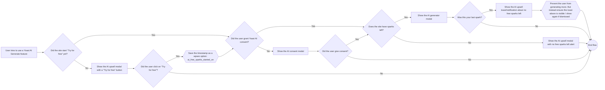

# AI Generator

This feature allows you to generate titles and descriptions for your content using AI.

We add a `Use AI` button to the current previews, via the replacement variable editor. The button ends up next to the
`Insert variable` button.

This button is not added on:

- Attachments
- Any fields that are not known previews (e.g. search, social and X)

## Flow to the AI generator in the editor

