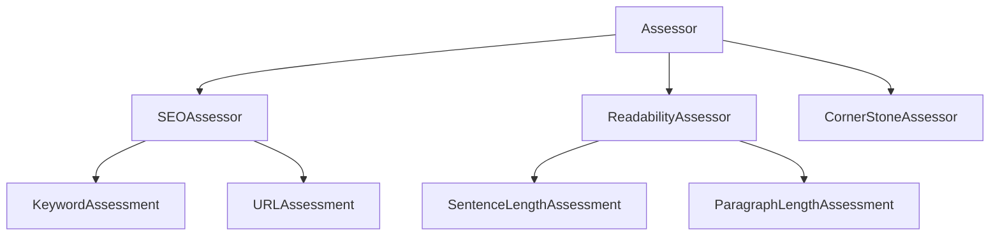
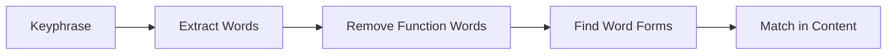

# YoastSEO.js Glossary

A comprehensive glossary of terms and concepts used in YoastSEO.js.

## Core Concepts

### <a name="paper"></a>Paper
A value object that encapsulates all content and metadata to be analyzed. The Paper object is immutable and serves as the primary input for all analyses.

**Properties include:**
- text: The main content to analyze
- title: The SEO title or page title
- keyword: The focus keyphrase
- description: Meta description
- url: The slug/URL of the page
- locale: Language code (e.g., en_US)
- permalink: Full URL

**Example:**
```javascript
const paper = new Paper("This is the main content", {
    title: "Example Title",
    keyword: "example",
    description: "This is a meta description",
    url: "example-page",
    locale: "en_US"
});
```

### <a name="assessment"></a>Assessment
A single analysis unit that evaluates one specific aspect of content. Each assessment:
- Has a specific purpose (e.g., keyword density analysis)
- Produces a score (0-100)
- Can generate improvement suggestions
- May include text markers for visual feedback

**Example Assessment Structure:**
```javascript
class KeywordDensityAssessment extends Assessment {
    getResult(paper, researcher) {
        const density = researcher.getResearch("keywordDensity");
        return {
            score: this.calculateScore(density),
            text: this.translateScore(density)
        };
    }
}
```

### <a name="assessor"></a>Assessor
A collection manager that:
- Coordinates multiple assessments
- Determines which assessments to run
- Aggregates assessment results
- Calculates overall scores

Types of assessors include:
- SEOAssessor: Focuses on search engine optimization
- ReadabilityAssessor: Analyzes text readability
- CornerStoneAssessor: Applies stricter rules for important content



### <a name="researcher"></a>Researcher
The research component that:
- Performs linguistic analysis
- Caches research results
- Provides research data to assessments

Common research types:
- Word count
- Sentence detection
- Keyword presence
- Morphological analysis

**Example Research Usage:**
```javascript
const researcher = new Researcher(paper);
const wordCount = researcher.getResearch("wordCountInText");
const sentences = researcher.getResearch("sentences");
```

### <a name="score"></a>Score
A numeric representation (0-100) of content quality for a specific aspect.

Score ranges:
- 0-40: Bad (Red)
- 41-70: Needs Improvement (Orange)
- 71-100: Good (Green)

### <a name="marker"></a>Marker
A system to highlight relevant parts of text for specific assessments. Markers:
- Help visualize assessment results
- Provide inline feedback
- Support multiple marking types (error, warning, good)

**Example Marker Output:**
```html
<mark class="yoast-text-mark">This sentence is too long</mark>
```

## Linguistic Concepts

### <a name="morphology"></a>Morphology
The study of word forms and their variations. In YoastSEO.js, morphology is used to:
- Recognize different forms of keywords
- Improve keyword matching
- Support language-specific word variations

**Example:**
```
Base word: teach
Morphological forms: teaches, teaching, taught, teacher, teachers
```

### <a name="stem"></a>Stem
The base form of a word before any affixes. Stemming helps in:
- Keyword matching
- Word form recognition
- Content analysis

**Example:**
```
Word: running
Stem: run
Related forms: runs, ran
```

### <a name="function-words"></a>Function Words
Words that serve grammatical purposes but carry little meaning:
- Articles (the, a, an)
- Prepositions (in, on, at)
- Conjunctions (and, or, but)
- Auxiliary verbs (is, has, will)

These are often filtered out during analysis to focus on meaningful content.

### <a name="content-words"></a>Content Words
Words that carry semantic meaning:
- Nouns (book, house)
- Main verbs (run, write)
- Adjectives (big, red)
- Adverbs (quickly, well)

These are crucial for:
- Keyword analysis
- Topic detection
- Content quality assessment

### <a name="keyphrase"></a>Keyphrase
The main search term or topic being targeted. Can be:
- Single word ("SEO")
- Multiple words ("WordPress SEO plugin")
- Contains function words ("how to bake bread")

**Keyphrase Analysis:**


### <a name="synonym"></a>Synonym
Alternative words or phrases with similar meaning to the keyphrase. Used to:
- Prevent keyword stuffing
- Allow natural writing
- Improve content quality

**Example:**
```
Keyphrase: "car"
Synonyms: "automobile", "vehicle", "motor vehicle"
``` 