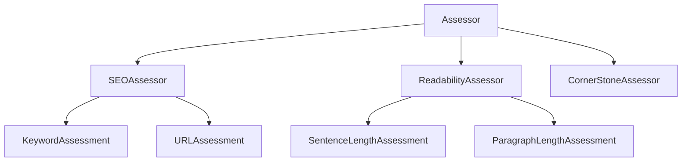
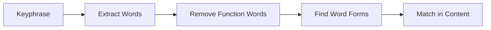

# YoastSEO.js Glossary

A comprehensive glossary of terms and concepts used in YoastSEO.js.

## Core Concepts

### <a name="paper"></a>Paper
A value object that encapsulates all content and metadata to be analyzed. The Paper object is immutable and serves as the primary input for all analyses.

**Properties include:**
- text: The main content to analyze. We assume the content follows a standard HTML format, and consists of the elements that would be part of the `<body>` (so no `<head>` or `<footer>` elements.
- title: The SEO title
- keyword: The focus keyphrase
- description: Meta description
- slug: The slug/URL of the page
- locale: Language code (e.g., en_US)
- permalink: Full URL

**Example:**
```javascript
const paper = new Paper("<p>This is the <strong>main</strong> content<p>", {
    title: "Example Title",
    keyword: "example",
    description: "This is a meta description",
    slug: "example-page",
    locale: "en_US"
});
```

### <a name="paperdto"></a>PaperDTO
A documented, serializable **input contract** for the engine (neutral core + a few optional, deprecated WordPress-transitional fields), exposed via the opt-in `yoastseo/contract` entry. A non-WordPress consumer sends a `PaperDTO` (plain JSON) and the `toPaper` boundary validates it and constructs an internal [Paper](#paper). It is the *external* counterpart of `Paper`: where `Paper` is the engine's internal value object, `PaperDTO` is the stable shape consumers send.

Key differences from `Paper`:
- Uses the canonical name **`keyphrase`** (mapped to the engine's `keyword`); `keyword` is accepted as a deprecated alias.
- Carries the WordPress-transitional fields (`wpBlocks`, `shortcodes`, `isFrontPage`) as **optional, deprecated** — they are real analysis inputs that change WordPress scores, so a remote/API analysis needs them for result parity.
- Authored in [zod](https://zod.dev); validates structure (wrong types / unknown keys throw) while leaving per-assessment fields optional (omitting one just skips that assessment).
- Extensible: consumers can `paperDtoSchema.extend({ … })` and build a mapper with `createToPaper` to validate custom fields for their own assessments.

**Example:**
```javascript
import { toPaper } from "yoastseo/contract";

const paper = toPaper({
    text: "<p>This is the <strong>main</strong> content</p>",
    keyphrase: "example",
    description: "This is a meta description",
    slug: "example-page",
    locale: "en_US"
});
```

### <a name="resultdto"></a>ResultDTO
A documented, serializable **output contract** for the engine, exposed via the same opt-in `yoastseo/contract` entry — the result-side sibling of [PaperDTO](#paperdto). The `toResultDTO` boundary maps a single engine [AssessmentResult](#assessment) onto the stable shape a non-WordPress consumer reads, so each consumer no longer hand-rolls its own view model.

Key points:
- Carries `identifier`, `score`, the interpreted `rating`, `text`, `marks`, `editFieldName`/`editFieldAriaLabel` (empty strings when none), and the neutral signals `isOptimizable` and `isBeta`.
- **`rating`** is computed in the boundary (a pure function of `score`) and never stored, so it cannot drift from `score`.
- **`isOptimizable`** / **`isBeta`** are the neutral contract names for the per-result signals behind the deprecated `AssessmentResult#hasAIFixes` / `#hasBetaBadge` getters.
- Authored in [zod](https://zod.dev); `marks` are serialized into a transport-agnostic shape.
- **i18n caveat:** `editFieldAriaLabel` (like `text`) is a pre-translated string carried as-is for now; a future i18n contract may replace it with a stable key derived from `editFieldName`.
- **No edit-affordance flag:** there is deliberately no `hasJumps`-style boolean — derive the affordance from `editFieldName` being non-empty (`Boolean( result.editFieldName )`), which is the single source of truth.

**Example:**
```javascript
import { toResultDTO } from "yoastseo/contract";

const results = seoAssessor.getValidResults().map( toResultDTO );
```

### <a name="assessment"></a>Assessment
A single analysis unit that evaluates one specific aspect of content. Each assessment:
- Has a specific purpose (e.g., the _keyword density_ assessment evaluates the number of keywords used in the content)
- Produces a score (0-9)
- May include text markers for visual feedback
- Can generate improvement suggestions (through Yoast AI)

**Example Assessment Structure:**
```javascript
class KeywordDensityAssessment extends Assessment {
    getResult(paper, researcher) {
        const density = researcher.getResearch("keywordDensity");
        return {
            score: this.calculateScore(density),
            text: this.translateScore(density)
        };
    }
}
```

### <a name="assessor"></a>Assessor
A collection manager that:
- Coordinates multiple assessments
- Determines which assessments to run
- Aggregates assessment results
- Calculates overall scores

Types of assessors include:
- SEOAssessor: Focuses on search engine optimization
- ReadabilityAssessor: Analyzes text readability
- CornerStoneAssessor: Applies stricter rules for important content

The diagram below shows an example hierarchy of assessors and assessments.


```mermaid
graph TD
    A[Assessor] --> B[SEOAssessor]
    A --> C[ReadabilityAssessor]
    A --> D[CornerStoneAssessor]
    B --> E[KeywordAssessment]
    B --> F[URLAssessment]
    C --> G[SentenceLengthAssessment]
    C --> H[ParagraphLengthAssessment]
```

### <a name="researcher"></a>Researcher
The research component that:
- Performs linguistic analysis
- Caches research results
- Provides research data to assessments

Common research types:
- Word count
- Sentence detection
- Keyword presence
- Morphological analysis

**Example Research Usage:**
```javascript
const researcher = new Researcher(paper);
const wordCount = researcher.getResearch("wordCountInText");
const sentences = researcher.getResearch("sentences");
```

### <a name="score"></a>Score
A numeric representation (0-100) of content quality for a specific aspect.

Score ranges:
- 0-40: Bad (Red)
- 41-70: Needs Improvement (Orange)
- 71-100: Good (Green)

### <a name="marker"></a>Marker
A system to highlight relevant parts of text for specific assessments. Markers:
- Help visualize assessment results
- Provide inline feedback

**Example Marker Output:**
```html
<mark class="yoast-text-mark">This sentence is too long</mark>
```

## Linguistic Concepts

### <a name="morphology"></a>Morphology
The study of word forms and their variations. In YoastSEO.js, morphology is used to:
- Recognize different forms of keywords
- Improve keyword matching
- Support language-specific word variations

**Example:**
```
Base word: teach
Morphological forms: teaches, teaching, taught, teacher, teachers
```

### <a name="stem"></a>Stem
The base form of a word before any affixes. Stemming helps in:
- Keyword matching
- Word form recognition
- Content analysis

**Example:**
```
Word: running
Stem: run
Related forms: runs, ran
```

### <a name="function-words"></a>Function Words
Words that serve grammatical purposes but carry little meaning:
- Articles (the, a, an)
- Prepositions (in, on, at)
- Conjunctions (and, or, but)
- Auxiliary verbs (is, has, will)

These are often filtered out during analysis to focus on meaningful content.

### <a name="content-words"></a>Content Words
Words that carry semantic meaning:
- Nouns (book, house)
- Main verbs (run, write)
- Adjectives (big, red)
- Adverbs (quickly, well)

These are crucial for:
- Keyword analysis
- Topic detection
- Content quality assessment

### <a name="keyphrase"></a>Keyphrase
The main search term or topic being targeted. We use `keyphrase` and `keyword` interchangeably, but primarily the former, as a keyphrase can be a single word ("SEO") or consist of multiple words ("WordPress SEO plugin"), and even contain function words ("how to bake bread").

**Keyphrase Analysis:**

```mermaid
graph LR
    A[Keyphrase] --> B[Extract Words]
    B --> C[Remove Function Words]
    C --> D[Find Word Forms]
    D --> E[Match in Content]
```

### <a name="synonym"></a>Synonym
Alternative words or phrases with similar meaning to the keyphrase. Used to:
- Prevent keyword stuffing
- Allow natural writing
- Improve content quality

**Example:**
```
Keyphrase: "car"
Synonyms: "automobile", "vehicle", "motor vehicle"
```
