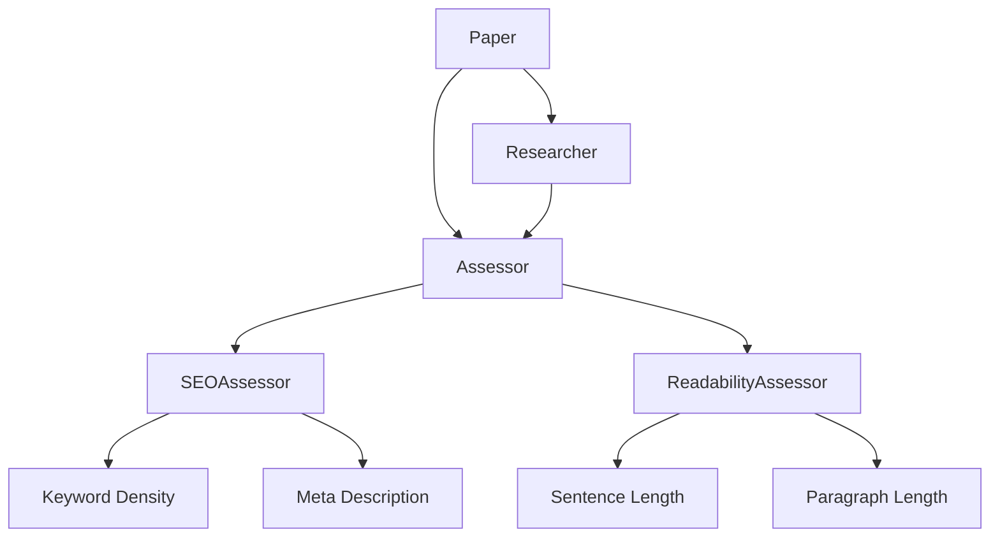
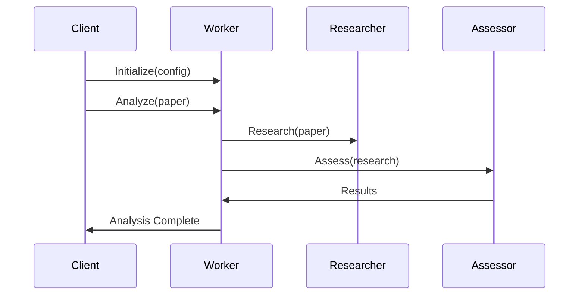

# YoastSEO.js Overview

YoastSEO.js is a text analysis and SEO assessment library that helps improve content readability and search engine optimization. This document provides an overview of the main concepts and components.

## Domain Glossary

### Core Concepts

- **[Paper](./GLOSSARY.md#paper)**: A value object representing the text content to be analyzed, including metadata like title, meta description, keyword, etc.
- **[Assessment](./GLOSSARY.md#assessment)**: An individual analysis that evaluates a specific aspect of content (e.g., keyword density, sentence length)
- **[Assessor](./GLOSSARY.md#assessor)**: A collection of assessments that work together to analyze content from a specific angle (SEO, readability, etc.)
- **[Researcher](./GLOSSARY.md#researcher)**: Performs linguistic research on text content (e.g., sentence detection, word counting)
- **[Score](./GLOSSARY.md#score)**: A numeric value (0-100) indicating how well content performs for a specific assessment
- **[Marker](./GLOSSARY.md#marker)**: Highlights relevant portions of text for specific assessments

### Linguistic Concepts

- **[Morphology](./GLOSSARY.md#morphology)**: Study of word forms and structure (stems, affixes, etc.)
- **[Stem](./GLOSSARY.md#stem)**: The base form of a word before any affixes are added
- **[Function Words](./GLOSSARY.md#function-words)**: Words with little semantic meaning that primarily serve grammatical purposes (e.g., articles, prepositions)
- **[Content Words](./GLOSSARY.md#content-words)**: Words that carry semantic meaning (nouns, verbs, adjectives, etc.)
- **[Keyphrase](./GLOSSARY.md#keyphrase)**: The main topic or search term being targeted in the content
- **[Synonym](./GLOSSARY.md#synonym)**: Alternative words or phrases with similar meaning to the keyphrase

## Architecture Diagrams

### High-level Component Interaction


### Analysis Flow


## Usage Examples

### Basic Usage with Web Worker

```javascript
import { AnalysisWorkerWrapper, createWorker, Paper } from "yoastseo";

// Create and initialize the worker
const worker = new AnalysisWorkerWrapper(createWorker("path-to-worker.js"));

await worker.initialize({
    locale: "en_US",
    contentAnalysisActive: true,
    keywordAnalysisActive: true,
});

// Create a paper with content to analyze
const paper = new Paper("Text to analyze", {
    keyword: "analysis",
    title: "My First Analysis",
    locale: "en_US"
});

// Run the analysis
const results = await worker.analyze(paper);
console.log(results);
```

### Direct Usage (Without Worker)

```javascript
import { AbstractResearcher, Paper, ContentAssessor } from "yoastseo";

// Create a paper with content
const paper = new Paper("Text to analyze", {
    keyword: "analysis",
    title: "My Analysis" 
});

// Create researcher and run research
const researcher = new AbstractResearcher(paper);
const wordCount = researcher.getResearch("wordCountInText");

// Create assessor and run assessments
const assessor = new ContentAssessor(researcher);
assessor.assess(paper);
const results = assessor.getValidResults();
```

## Key Features

1. **Multilingual Support**: Supports analysis in multiple languages with language-specific rules and assessments

2. **Extensible Architecture**: 
   - Custom assessments can be added
   - Research can be extended
   - Markers can be customized

3. **SEO Analysis**:
   - Keyword usage and density
   - Meta description optimization
   - URL structure
   - Internal linking
   - Image alt attributes

4. **Readability Analysis**:
   - Sentence length
   - Paragraph length
   - Transition words
   - Passive voice
   - Flesch Reading Ease

5. **Performance**:
   - Web Worker support for non-blocking analysis
   - Memoization of research results
   - Configurable analysis depth

## Integration Points

The library can be integrated in several ways:

1. **Web Worker**: Recommended approach for browser environments to prevent UI blocking
2. **Direct Usage**: For server-side analysis or simpler implementations
3. **WordPress Integration**: Primary use case through the Yoast SEO plugin
4. **Custom CMS Integration**: Can be integrated into any CMS or editing environment

For more detailed documentation on specific topics, see:
- [Assessments Documentation](./src/scoring/assessments/README.md)
- [Morphology Documentation](./MORPHOLOGY.md)
- [Design Decisions](./DESIGN%20DECISIONS.md) 