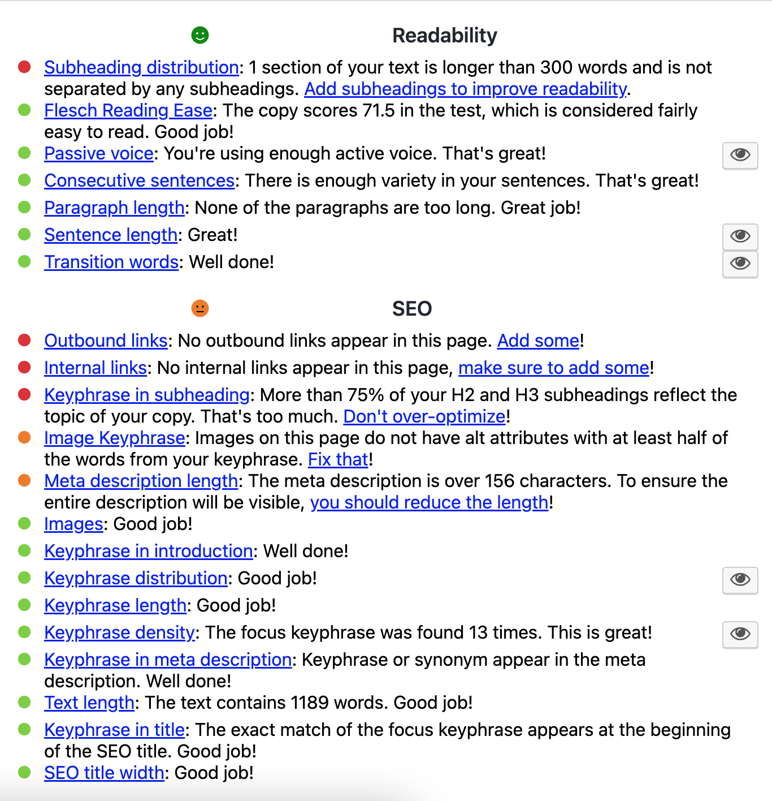

# YoastSEO.js

Text analysis and assessment library in JavaScript. This library can generate interesting metrics about a text and assess these metrics to give you an assessment which can be used to improve the text.



Also included is a preview of the Google search results which can be assessed using the library.

## Documentation
* A list of all the [assessors](https://github.com/Yoast/wordpress-seo/blob/trunk/packages/yoastseo/src/scoring/assessors/ASSESSORS%20OVERVIEW.md)
* Information on the [scoring system of the assessments](https://github.com/Yoast/wordpress-seo/blob/trunk/packages/yoastseo/src/scoring/assessments/README.md)
  * [SEO analysis scoring](https://github.com/Yoast/wordpress-seo/blob/trunk/packages/yoastseo/src/scoring/assessments/SCORING%20SEO.md)
  * [Readability analysis scoring](https://github.com/Yoast/wordpress-seo/blob/trunk/packages/yoastseo/src/scoring/assessments/SCORING%20READABILITY.md)
  * [Inclusive language analysis scoring](https://github.com/Yoast/wordpress-seo/blob/trunk/packages/yoastseo/src/scoring/assessments/SCORING%20INCLUSIVE%20LANGUAGE.md)
  * [How keyphrase matching works](https://github.com/Yoast/wordpress-seo/blob/trunk/packages/yoastseo/src/scoring/assessments/KEYPHRASE%20MATCHING.md)
  * [Scoring on taxonomy pages](https://github.com/Yoast/wordpress-seo/blob/trunk/packages/yoastseo/src/scoring/assessments/SCORING%20TAXONOMY.md)
* The data that will be analyzed by YoastSEO.js can be modified by plugins. Plugins can also add new research and assessments. To find out how to do this, checkout out the [customization documentation](https://github.com/Yoast/wordpress-seo/blob/trunk/packages/yoastseo/docs/Customization.md).
* Information on the design decisions within the package can be found [here](https://github.com/Yoast/wordpress-seo/blob/trunk/packages/yoastseo/DESIGN%20DECISIONS.md).
* Information on how morphology works in `yoastseo` package can be found [here](https://github.com/Yoast/wordpress-seo/blob/trunk/packages/yoastseo/MORPHOLOGY.md).


## Installation

You can install YoastSEO.js using npm:

```bash
npm install yoastseo
```

Or using yarn:

```bash
yarn add yoastseo
```

## Usage

You can either use YoastSEO.js using the web worker API or use the internal components directly.

Because a web worker must be a separate script in the browser you first need to create a script for inside the web worker:

```js
import { AnalysisWebWorker } from "yoastseo";

const worker = new AnalysisWebWorker( self );
worker.register();
```

Then in a different script you have the following code:

```js
import { AnalysisWorkerWrapper, createWorker, Paper } from "yoastseo";

// `url` needs to be the full URL to the script for the browser to know where to load the worker script from.
// This should be the script created by the previous code-snippet.
const url = "https://my-site-url.com/path-to-webworker-script.js"

const worker = new AnalysisWorkerWrapper( createWorker( url ) );

worker.initialize( {
    locale: "en_US",
    contentAnalysisActive: true,
    keywordAnalysisActive: true,
    logLevel: "ERROR",
} ).then( () => {
    // The worker has been configured, we can now analyze a Paper.
    const paper = new Paper( "Text to analyze", {
        keyword: "analyze",
    } );

    return worker.analyze( paper );
} ).then( ( results ) => {
    console.log( 'Analysis results:' );
    console.log( results );
} ).catch( ( error ) => {
    console.error( 'An error occured while analyzing the text:' );
    console.error( error );
} );
```

### Usage of internal components

If you want to have a more bare-bones API, or are in an environment without access to Web Worker you can use the internal objects:

```js
import { AbstractResearcher, Paper } from "yoastseo";

const paper = new Paper( "Text to analyze", {
    keyword: "analyze",
} );
const researcher = new AbstractResearcher( paper );

console.log( researcher.getResearch( "wordCountInText" ) );
```

**Note: This is currently a synchronous API, but will become an asynchronous API in the future.**

## Supported languages

### SEO analysis
**Function word support**, which is used for internal linking, insights, and keyphrase-related analysis, is available in the following languages:

English, German, Dutch, French, Spanish, Italian, Portuguese, Russian, Polish, Swedish, Hungarian, Indonesian, Arabic,
Hebrew, Farsi, Turkish, Norwegian, Czech, Slovak, Greek, Japanese

### Readability analysis

| Language   	| Transition words 	| Flesch reading ease 	| Passive voice 	| Sentence beginnings 	| Sentence length<sup>1</sup> 	|
|------------	|------------------	|---------------------	|---------------	|---------------------	|-----------------------------	|
| English    	| ✅                	| ✅                   	| ✅             	| ✅                   	| ✅                           	|
| German     	| ✅                	| ✅                   	| ✅             	| ✅                   	| ✅                           	|
| Dutch      	| ✅                	| ✅                   	| ✅             	| ✅                   	| ✅                           	|
| French     	| ✅                	| ✅                   	| ✅             	| ✅                   	| ✅                           	|
| Spanish    	| ✅                	| ✅                   	| ✅             	| ✅                   	| ✅                           	|
| Italian    	| ✅                	| ✅                   	| ✅             	| ✅                   	| ✅                           	|
| Portuguese 	| ✅                	| ✅                   	| ✅             	| ✅                   	| ✅                           	|
| Russian    	| ✅                	| ✅                   	| ✅             	| ✅                   	| ✅                           	|
| Catalan    	| ✅                	| ❌<sup>3</sup>         | ❌<sup>3</sup>    | ❌<sup>3</sup>        | ❌<sup>3</sup>                 |
| Polish     	| ✅                	| ❌<sup>2</sup>       	| ✅             	| ✅                   	| ✅                           	|
| Swedish    	| ✅                	| ❌<sup>2</sup>       	| ✅             	| ✅                   	| ✅                           	|
| Hungarian  	| ✅                	| ❌<sup>2</sup>        |  ✅          	    | ✅           	        | ✅             	            |
| Indonesian 	| ✅                	| ❌<sup>2</sup>       	| ✅             	| ✅                   	| ✅                           	|
| Arabic    	| ✅                	| ❌<sup>2</sup>        | ✅             	| ✅                   	| ✅                           	|
| Hebrew        | ✅                    | ❌<sup>2</sup>        | ✅                | ✅                     | ✅                            |
| Farsi    	    | ✅                    | ❌<sup>2</sup>        | ✅              	| ✅                    | ✅                             |
| Turkish     	| ✅                	| ❌<sup>2</sup>       	| ✅             	| ✅                   	| ✅                           	|
| Norwegian     | ✅                	| ❌<sup>2</sup>        | ✅                 | ✅                   	| ✅                           	|
| Czech     	| ✅                	| ❌<sup>2</sup>       	| ✅             	| ✅                   	| ✅                           	|
| Slovak     	| ✅                	| ❌<sup>2</sup>       	| ✅             	| ✅                   	| ✅                           	|
| Greek     	| ✅                	| ❌<sup>2</sup>       	| ✅             	| ✅                   	| ✅                           	|
| Japanese     	| ✅                	| ❌<sup>2</sup>       	| ❌<sup>4</sup>    | ✅                    | ✅                            |

<sup>1</sup> This means the default upper limit of 20 words has been verified for this language, or the upper limit has been changed.

<sup>2</sup> There is no existing Flesch reading ease formula for these languages.

<sup>3</sup> This means that the functionality for this assessment is currently not available for these languages.

<sup>4</sup> The Passive voice check for Japanese is not implemented since the structure is the same as the potential form and can additionally be used for an honorific purpose. Identifying whether a verb is in its passive, honorific or potential form is problematic without contextual information.

The following readability assessments are available for all languages:
- sentence length (with a default upper limit of 20 words, see<sup>1</sup> above )
- paragraph length
- subheading distribution
- text presence

### Inclusive language analysis

The inclusive language analysis is currently available in English.

## Change log

Please see [CHANGELOG](CHANGELOG.md) for more information what has changed recently.

## Testing

```bash
npm test
```

Or using yarn:

```bash
yarn test
```

Generate coverage using the `--coverage` flag.

## Code style

To test your code style:

```bash
yarn lint
```

## Testing with Yoast SEO

In the YoastSEO.js directory, run:

```bash
npm link
```

Or using yarn:

```bash
yarn link
```

Then, in the project directory where you want to test the package, assuming you have a complete development version, run:

```bash
npm link yoastseo
```
Or using yarn:

```bash
yarn link yoastseo
```

If you want to unlink, simply do:

```bash
npm unlink yoastseo
```
Or using yarn:

```bash
yarn unlink yoastseo
```

## Contributing

Please see [CONTRIBUTING](.github/CONTRIBUTING.md) for details.

## Security

If you discover any security related issues, please email security [at] yoast.com instead of using the issue tracker.

## Credits

- [Team Yoast](https://github.com/orgs/Yoast/people)
- [All Contributors](https://github.com/Yoast/wordpress-seo/graphs/contributors)

## License

We follow the GPL. Please see [License](LICENSE) file for more information.
